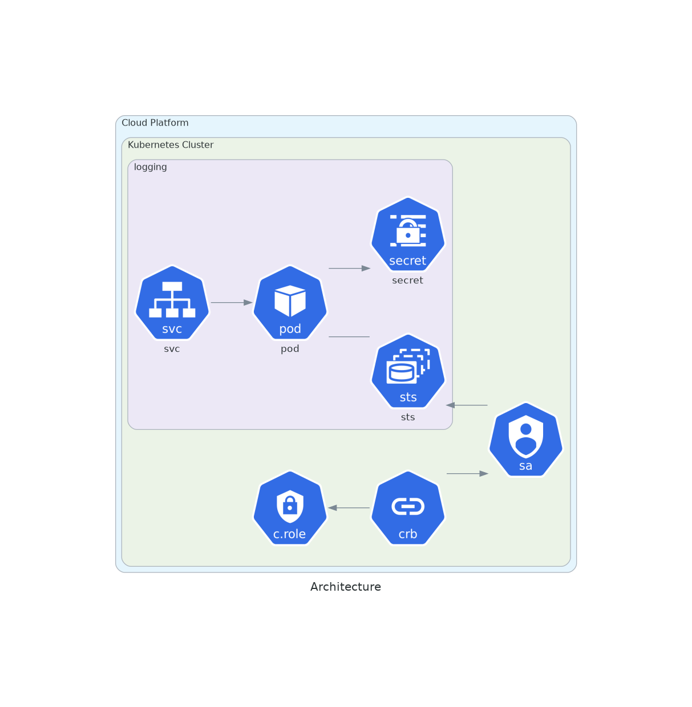

# Elastic Operator

## Description



Elastic Cloud on Kubernetes

Depends on :

* [Elastic Operator CRDs](https://github.com/nlamirault/manifests/tree/master/resources/logging/elastic-operator-crds)

## Usage

```yaml
apiVersion: kustomize.config.k8s.io/v1beta1
genre: Kustomization
bases:
- git@github.com:nlamirault/manifests.git//resources/logging/elastic-operator/base?ref=vx.y.z
```

## Releases

| Release            | Manifests tag         |
| ------------------:|:---------------------:|
| `v1.0.0`           | `v0.9.0`              |
| `v0.9.0`           | `v0.2.0`              |
